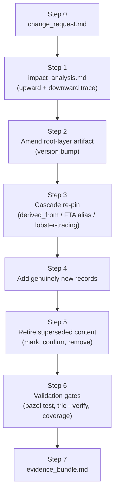

<!-- ----------------------------------------------------------------------------
  Copyright (c) 2026 Contributors to the Eclipse Foundation

  See the NOTICE file(s) distributed with this work for additional
  information regarding copyright ownership.

  This program and the accompanying materials are made available under the
  terms of the Apache License Version 2.0 which is available at
  https://www.apache.org/licenses/LICENSE-2.0

  SPDX-License-Identifier: Apache-2.0
----------------------------------------------------------------------------- -->

# S-CORE SEooC Actualization Lifecycle — Orchestrating Skill

This skill is the router and process backbone for **updating an already-authored S-CORE Safety
Element out of Context (SEooC)** built with the `rules_score` Bazel rules, when its existing
requirements/architecture/safety-analysis/test artifacts are the **trusted baseline** for the
project — not evidence to discard — but the world has moved: a new need appeared, a defect was
found, an assumption stopped holding, or the design silently drifted from the code. It sequences
the same four mechanical skills as `rules-score` (`score-requirements`, `score-architecture`,
`score-safety-analysis`, `score-testing`), but drives them through **impact analysis and
minimal-diff cascade** instead of top-down fresh derivation.

**This skill is intentionally component-agnostic.** It must never be edited to bake in the domain
content of one particular component. Component-specific knowledge belongs in that component's
`research/` scratchpad and its frozen/updated TRLC/PlantUML artifacts.

## Which lifecycle skill do I need?

| Situation | Use |
|---|---|
| No `dependable_element` exists yet for this component | **rules-score**, fresh Step 0 |
| Existing artifacts are low-maturity/PoC-quality and explicitly discardable (no external consumer relies on their names/wording) | **rules-score**, "Handling a rework" |
| Existing artifacts are the project's trusted baseline (released or actively relied upon), and something changed, was found wrong, or needs extending | **rules-score-actualize** (this skill) |

If you are unsure which bucket a component is in, ask the human — do not guess whether an existing
baseline is discardable.

## When to use

- A new informal need lands on top of an **already-existing** dependable_element (not a blank
  slate) — e.g. a new consumer needs a capability the current contract doesn't promise.
- A defect is found: the code, a test, or an architecture-consistency/coverage-lock check
  contradicts a frozen requirement, diagram, or safety record.
- An `AssumedSystemReq`/`AoU` no longer holds because the environment changed.
- A requirement or behaviour is obsolete and should be retired without breaking traceability.
- Deciding the **smallest correct set** of existing artifacts a change must touch, and in what
  order, without re-deriving the whole component from scratch.

## Not for

- Bootstrapping a `dependable_element` that doesn't exist yet, or wholesale-discarding a
  low-maturity/PoC baseline → **rules-score**
- The mechanics of writing a `.trlc` record once you know what it should say → **score-requirements**
- PlantUML diagrams and the Bazel hierarchy once the target decomposition is agreed →
  **score-architecture**
- FMEA/FTA/`FailureMode`/`ControlMeasure` mechanics once the failure reasoning is done →
  **score-safety-analysis**
- Test annotation and `test_case_coverage.lock.yaml` mechanics once coverage intent is decided →
  **score-testing**

---

## Core principles

1. **Additive and minimal by default.** Express a change as either (a) an in-place edit **and**
   version bump of exactly the record(s)/diagram(s) whose content actually changed, or (b) a
   genuinely new record for genuinely new content. Never rewrite, rename, or reshuffle an
   unaffected artifact just to "clean it up" while you're in the area — log opportunistic findings
   in `backlog.md` instead of acting on them.
2. **Freeze what the change doesn't touch.** If a layer, record, or diagram falls outside the
   impact analysis (see Step 1 below), it does not appear in the diff at all. A large, sprawling
   diff for a small stated change is a sign the impact analysis was wrong, not a sign of
   thoroughness.
3. **Impact analysis runs both directions before any edit.** For the artifact that appears to be
   directly affected, walk **upward** first — what does it derive from, and is the *real* defect
   actually one layer higher (a wrong `FeatReq` masquerading as a `CompReq` bug, a wrong diagram
   masquerading as a wrong safety record)? Never patch a downstream symptom while the upstream
   defect stays in place. Then walk **downward** — every `derived_from` reference, every FTA
   `$BasicEvent`/`$TransferInGate` alias, every `lobster-tracing` id, every
   `test_case_coverage.lock.yaml` entry that points at what you are about to change — to build the
   full ripple set that must be re-pinned or re-verified.
4. **Version bump + re-pin discipline is not optional.** Every content change bumps `version`
   (per `score-requirements`); every downstream reference to that record is updated to the new
   version in the same cycle. A change that "forgot" a ripple reference is incomplete, not done.
5. **Distinguish "wrong today" from "was right, world changed".** A record can be factually wrong
   right now (defect) or can have been a correct, deliberate decision that a new fact (new
   consumer, new assumption) now invalidates. The write-up in `change_request.md` (Step 0) must say
   which one it is — it changes where the fix belongs and whether the original author's intent
   needs revisiting.
6. **Retire, don't silently delete.** An obsolete requirement/record is marked superseded/deprecated
   (e.g. a `note` explaining why, and what replaces it) and only physically removed once the
   downward ripple confirms nothing still references it. Removing a record that something else
   still `derived_from`s or traces a test to breaks the build loudly — treat that as the safety net
   it is, not an obstacle to route around.
7. **Human-in-the-loop scoped to what changed.** Unlike a full fresh lifecycle, you do not need a
   checkpoint on every layer of the model — only on the layers the impact analysis says are
   touched. But every touched layer still gets an explicit human go-ahead before its version bump
   is treated as final.
8. **Everything is a file, nothing is memory.** The change's rationale, its impact analysis, and
   its evidence bundle live in git-tracked files under the component's `research/` directory (see
   below), not in agent/session memory, so the next actualization cycle — possibly months later,
   by a different person — can reconstruct why a version was bumped.
9. **Maturity raises the stakes, it doesn't change the process.** If the component's
   `dependable_element.maturity` is `"development"`, drift/coverage/GWT violations are warnings
   during the work; if it is `"release"`, the same violations fail the build. Either way, run the
   same impact-analysis-first process — `"release"` maturity is a reason for a more careful human
   review before merging, not a reason to skip steps.

---

## The `research/` directory (adapted for repeated, ongoing cycles)

A component actualized through this skill is expected to go through **many** cycles over its
lifetime — unlike `rules-score`'s one-shot bootstrap, this scratchpad convention must not let
successive cycles clobber each other's history.

```
<component>/research/
├── problem_statement.md     # OPTIONAL, amended in place across cycles (see below) — a living
│                             # orientation snapshot, never itself the source of truth once the
│                             # component has frozen TRLC/PlantUML artifacts
├── changes/
│   └── <YYYY-MM-DD>-<slug>/  # one directory per actualization cycle, never reused or overwritten
│       ├── change_request.md    # Step 0 output: the trigger, in the vocabulary of Core Principle 5
│       ├── impact_analysis.md   # Step 1 output: upward root-cause + downward ripple set
│       ├── work_log.md          # append-only, dated entries for this cycle only
│       ├── next_steps.md        # current step within this cycle
│       └── evidence_bundle.md   # Step 6 output: final change list, version-bump table, ripple
│                                 # map, residual risk / deferred items
├── references.md            # long-lived, shared across all cycles
├── backlog.md                # long-lived, shared across all cycles — opportunistic findings land
│                             # here (Core Principle 1), not in the current cycle's diff
└── nice_to_haves.md          # long-lived, shared across all cycles
```

### If `research/` does not exist yet for this component

Components actualized with this skill may predate the `research/` convention entirely (they may
never have gone through a `rules-score` bootstrap). Before the first real change cycle, do a
one-time, read-only **baseline snapshot**:

- Read the component's existing frozen artifacts (`assumed_system/`, `requirements/`,
  `software_architectural_design/`, `safety_analysis/`, tests/coverage lock) and summarize them in
  `research/problem_statement.md` — terminology, system slice, current requirement/architecture
  index, current maturity and ASIL. This is **reverse documentation of a trusted baseline**, not
  the fresh, discardable-evidence derivation `rules-score` Step 0 performs against a PoC. Say so
  explicitly in the file so a later reader does not mistake it for authoritative source-of-truth —
  the frozen TRLC/PlantUML remain authoritative; this file exists only to orient future cycles
  quickly without re-reading the whole tree.
- Seed `references.md`, `backlog.md`, `nice_to_haves.md`, even if only with what the baseline
  read-through surfaced.
- Do **not** invent a change in this step. If there is no concrete trigger yet, stop here and ask
  the human what the first actualization cycle should be about.

### Keeping it current

- **`work_log.md`** (per cycle): append a dated entry every time a step starts or finishes inside
  that cycle. Never rewrite history.
- **`next_steps.md`** (per cycle): always reflects the *current* step in this cycle's table below;
  stale entries are removed, not accumulated.
- **`problem_statement.md`** (component-wide): amended, never silently rewritten — when a cycle's
  change affects the terminology/system-slice/informal-requirements narrative, append a short
  dated note under a `## Changelog` section at the bottom pointing at the cycle directory that
  caused the update, then edit the body. Do not delete the changelog trail.
- **`backlog.md`** / **`nice_to_haves.md`**: capture out-of-scope or opportunistic findings from
  every cycle; do not fold them into the current cycle's diff (Core Principle 1).

### `change_request.md` template

```markdown
# <Component> — Change Request: <short slug>

## Trigger
<what happened: new informal ask / defect report / architecture-consistency or coverage-lock
drift / assumption invalidated. Reference the source: an issue, a docx, a failing test, a diff.>

## Classification
<"wrong today" (defect in an existing record) vs. "was right, world changed" (Core Principle 5) —
state which, and why.>

## Stated scope
<what the requester believes needs to change, in their words — kept separate from your own impact
analysis, which comes next in impact_analysis.md and may reveal a larger or smaller true scope.>

## Open Questions
<anything needing a human decision before impact analysis can start.>
```

### `impact_analysis.md` template

```markdown
# <Component> — Impact Analysis: <cycle slug>

## Upward trace (root-cause localization)
<starting from the artifact that looks directly affected, trace derived_from links upward until
you reach the layer where the change actually originates. State the conclusion: "the true origin
is <layer>.<RecordId>@<version>", not just "somewhere near X".>

## Downward trace (ripple set)
<every derived_from reference, FTA $BasicEvent/$TransferInGate alias, lobster-tracing id, and
test_case_coverage.lock.yaml entry that points at the record(s) about to change. One row per
reference: current pin → what it must become.>

## Artifacts to touch
<the minimal, closed set: which .trlc records (with old→new version), which .puml diagrams, which
FailureMode/ControlMeasure records, which tests/lock entries. Anything found during the trace that
is NOT in this set stays untouched.>

## Artifacts explicitly NOT touched (and why)
<short list — the point is to make the "freeze what the change doesn't touch" boundary visible and
reviewable, not just implicit.>
```

---

## Lifecycle steps & checkpoints (per change cycle)

| # | Step | Artifact skill | Checkpoint |
|---|------|-----------------|-------------|
| 0 | Capture the trigger in `changes/<cycle>/change_request.md` | — | Human confirms the trigger, its classification (Core Principle 5), and its stated scope are correctly understood |
| 1 | Impact analysis in `changes/<cycle>/impact_analysis.md`: upward root-cause trace + downward ripple trace | score-requirements / score-architecture / score-safety-analysis / score-testing (read-only) | Human confirms the impact set is complete, closed, and rooted at the correct layer |
| 2 | Amend the root-layer artifact(s): edit content, bump `version` | matching skill for that layer | Human confirms the new wording/diagram/measure is correct |
| 3 | Cascade: re-pin every downstream reference identified in Step 1 to the new version — a re-pin only, no new content smuggled in | matching skill(s) | Lightweight — verify each cascade edit is purely a version-pin update |
| 4 | Add genuinely new records the change requires (new `CompReq`, `FailureMode`, test, `AoU`, …) | matching skill(s) | Human confirms new records are correctly leveled/allocated, not disguised edits of unrelated existing ones |
| 5 | Retire superseded/obsolete content: mark it (note + rationale), confirm via the downward trace that nothing else still references it, then remove | score-requirements (mostly) | Human confirms removal is safe before it happens |
| 6 | Validation gates over the whole component: `bazel test //...`, `trlc --verify`, architecture-consistency, coverage-drift, AI quality checks (`tags = ["manual"]`) | all four | Human reviews any warnings, especially ones surfaced only because `maturity = "development"` |
| 7 | Evidence bundle in `changes/<cycle>/evidence_bundle.md`: final change list, version-bump table, ripple map, residual risk / anything deferred to `backlog.md` | — | Human accepts the cycle |

Steps 2–4 may interleave in either order once Step 1's impact set is agreed (e.g. a new `CompReq`
in Step 4 might need its own new test before Step 6 validation, while an unrelated ripple re-pin
from Step 3 proceeds independently) — but nothing in Steps 2–5 starts before Step 1's checkpoint,
and Step 6 does not start until every artifact in Step 1's closed set has been addressed by 2–5.

---

## Worked shape of a cycle (illustrative, component-agnostic)



---

## References

- `.github/skills/rules-score/SKILL.md` — the fresh/rework lifecycle this skill is the companion
  to; read it for the four mechanical skills' full mechanics and the `research/` convention this
  one adapts.
- `.github/skills/score-requirements/SKILL.md`, `.github/skills/score-architecture/SKILL.md`,
  `.github/skills/score-safety-analysis/SKILL.md`, `.github/skills/score-testing/SKILL.md` — the
  four mechanical skills this one sequences, in delta mode.
- [Dependable Element Concept & Automatic Validations](https://eclipse-score.github.io/tooling/latest/user_guide/general.html)
  — canonical description of what `rules_score` enforces (architecture consistency, certified
  scope, integrity level, coverage-lock drift) — the same checks this skill's Step 6 relies on to
  catch an incomplete cascade.
